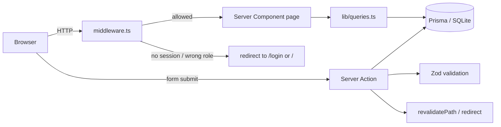

# Architecture

## Overview

Muse is a single Next.js 15 application using the **App Router**. There is no
separate backend service — data access and mutations run inside the Next.js
server runtime through **React Server Components** (for reads) and **Server
Actions** (for writes). SQLite (via Prisma) is the datastore, and authentication
is a self-contained JWT-cookie layer.



## Rendering model

- **Server Components by default.** Pages under `src/app/**` are async server
  components that call the data layer directly and render HTML on the server.
  This keeps the client bundle small and makes pages SEO-friendly.
- **Client Components where interaction is needed.** Files marked `"use client"`
  handle local state and browser APIs — the header menu, theme toggle, gallery
  filters, image lightbox, interactive star rating, and forms using
  `useActionState` / `useFormStatus`.
- **Server Actions for mutations.** All writes (`register`, `login`,
  `createModel`, `addReview`, `decideModel`, …) are `"use server"` functions.
  They work with JavaScript disabled (progressive enhancement) because Next.js
  posts the form to the action directly.

## Directory layout

```
src/
├── app/                      # Routes (App Router)
│   ├── layout.tsx            # Root layout: fonts, theme boot script, header/footer
│   ├── globals.css           # Design tokens (CSS vars) + Tailwind layers
│   ├── page.tsx              # Landing page
│   ├── not-found.tsx         # 404
│   ├── models/
│   │   ├── page.tsx          # Gallery (filters + grid)
│   │   └── [slug]/page.tsx   # Profile detail + reviews
│   ├── submit/page.tsx       # Submit-talent form (auth required)
│   ├── login/page.tsx
│   ├── register/page.tsx
│   ├── dashboard/page.tsx    # A user's own submissions (auth required)
│   └── admin/                # Admin console (admin required)
│       ├── layout.tsx        # Guard + tab nav + stats
│       ├── page.tsx          # Overview
│       ├── approvals/page.tsx# Approval queue
│       └── models/page.tsx   # Roster table
├── actions/                  # Server actions (write operations)
│   ├── auth.ts               # register / login / logout
│   ├── models.ts             # create / decide / feature / delete
│   └── reviews.ts            # add/update review + rating recompute
├── components/
│   ├── ui/                   # Design-system primitives
│   ├── layout/               # Header, footer
│   ├── models/               # Cards, filters, gallery, submit form
│   ├── reviews/              # Review form, list, summary
│   └── admin/                # Approval card, nav, row actions
├── lib/
│   ├── prisma.ts             # Prisma client singleton
│   ├── session.ts            # JWT sign/verify (edge-safe, no DB)
│   ├── auth.ts               # Cookie helpers + guards (server-only)
│   ├── queries.ts            # All read queries (server-only)
│   ├── validations.ts        # Zod schemas
│   ├── constants.ts          # Categories, genders, sort options, status meta
│   └── utils.ts              # Pure helpers (cn, slugify, formatters, guards)
└── middleware.ts             # Route protection at the edge
prisma/
├── schema.prisma
└── seed.ts
test/                         # Vitest unit/component tests
```

## Layering rules

The dependency direction is one-way, which keeps modules testable:

```
app / components  ->  actions  ->  lib (queries, auth)  ->  lib (prisma, session, utils)
```

- `lib/utils.ts`, `lib/constants.ts`, `lib/session.ts`, `lib/validations.ts` are
  **pure / dependency-light** and safe to import anywhere (including the client
  bundle and tests). They have no `server-only` marker.
- `lib/auth.ts` and `lib/queries.ts` are marked `import "server-only"` — they
  touch cookies or the database and must never be bundled to the client. Because
  of this they are intentionally **not** imported by unit tests; their logic is
  exercised through the end-to-end verification described in the root README.

## Key design decisions

| Decision | Rationale | Trade-off / how to change |
| --- | --- | --- |
| **SQLite + Prisma** | Zero-config local dev; a single file DB that ships seeded. | Swap `provider`/`DATABASE_URL` in `schema.prisma` to Postgres for production. |
| **Custom JWT-cookie auth** (not NextAuth) | Full control, edge-compatible verification via `jose`, no beta dependency churn. | Fewer batteries included (no OAuth providers). See [authentication](./authentication.md). |
| **Denormalised rating cache** (`ratingAvg`, `ratingCount` on `Model`) | Gallery and cards sort/read ratings without aggregating on every request. | Must be recomputed on review writes (`recomputeRating`). |
| **Gallery stored as JSON string** | SQLite has no array type; portfolio image lists are small and read whole. | Parsed defensively via `parseGallery`. Move to a related table if you need per-image metadata. |
| **URL-driven gallery filters** | Shareable/bookmarkable views; server renders the filtered result. | Filter state lives in the query string, updated with `router.replace`. |
| **Deterministic gradient image fallback** | The UI never breaks when a remote image is missing/offline. | See `ModelImage` and `gradientFromString`. |

## Theming

Colors are defined as HSL CSS variables in `globals.css` under `:root` and
`.dark`. Tailwind maps them to semantic color names (`bg-background`,
`text-muted-foreground`, `bg-accent`, …) in `tailwind.config.ts`. A tiny inline
script in the root layout applies the persisted/system theme **before paint** to
avoid a flash of the wrong theme; `ThemeToggle` persists the choice to
`localStorage`.
