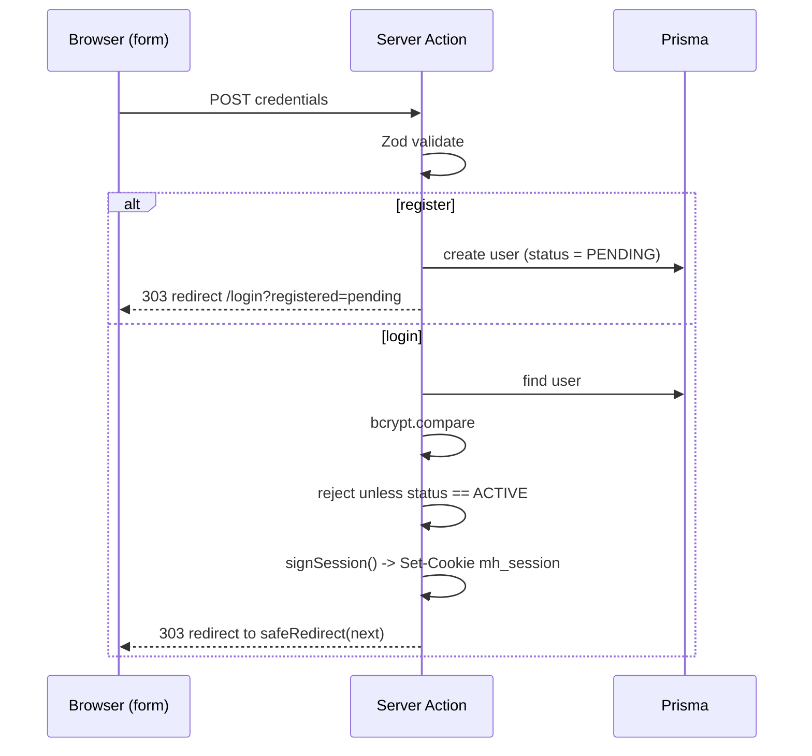
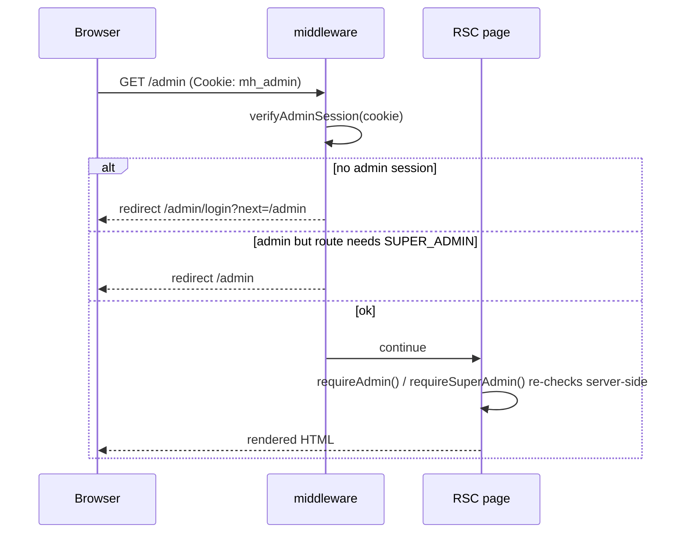

# Authentication & authorization

Muse uses a self-contained, framework-native auth layer: **email + password**
credentials, hashed with **bcrypt**, and **signed JWTs stored in httpOnly
cookies**. There is no third-party auth provider.

## Two independent principals

Public **members** and agency **admins** are completely separate:

| | Members | Admins |
| --- | --- | --- |
| Table | `User` | `Admin` |
| Login | `/login` | `/admin/login` |
| Cookie | `mh_session` | `mh_admin` |
| Payload | `SessionUser` (no role) | `SessionAdmin` (`SUPER_ADMIN`/`MODERATOR`) |
| Can register itself? | yes (`/register`) | no — created by a super admin |

A member account can **never** gain admin access: the admin session is verified
against a different table, a different cookie and a token that carries a
`kind: "admin"` claim. The two logins are independent — signing in to one does
not affect the other.

## Modules

| File | Responsibility | Runtime |
| --- | --- | --- |
| [`lib/session.ts`](../src/lib/session.ts) | Sign/verify both JWTs; cookie names & max-age. Uses `jose` (no DB, no `next/headers`). | Edge + Node |
| [`lib/auth.ts`](../src/lib/auth.ts) | Read/set/clear cookies; `getCurrentUser`/`requireUser`, `getCurrentAdmin`/`requireAdmin`/`requireSuperAdmin`. Marked `server-only`. | Node (RSC) |
| [`actions/auth.ts`](../src/actions/auth.ts) | `registerAction`, `loginAction`, `logoutAction`, `adminLoginAction`, `adminLogoutAction`. | Node (server action) |
| [`actions/admins.ts`](../src/actions/admins.ts) | `createAdminAction`, `deleteAdminAction` — super-admin only. | Node (server action) |
| [`middleware.ts`](../src/middleware.ts) | Guards protected route prefixes at the edge. | Edge |

Splitting *session crypto* (`session.ts`) from *cookie/DB access* (`auth.ts`) is
deliberate: middleware runs on the edge runtime where `jose` works but Prisma and
`next/headers` do not, so it imports only `session.ts`.

## The session tokens

Both tokens are HS256 JWTs signed with `AUTH_SECRET`, expiring after 7 days.

```ts
type SessionUser  = { id: string; name: string; email: string };
type AdminRole    = "SUPER_ADMIN" | "MODERATOR";
type SessionAdmin = { id: string; name: string; email: string; role: AdminRole };
```

- `signSession` / `verifySession` handle the member token.
- `signAdminSession` / `verifyAdminSession` handle the admin token. The admin
  token additionally carries `kind: "admin"`, and `verifyAdminSession` rejects
  any token without it — so a member token can never be verified as an admin.

Each `verify*` checks the signature **and** the claim shape, returning `null`
for anything missing, malformed, expired, or signed with the wrong secret. The
admin role is carried in the token so the edge middleware can gate
role-restricted routes without a DB lookup.

## The cookies

Both are set with the same attributes (in `createSession` / `createAdminSession`,
[`lib/auth.ts`](../src/lib/auth.ts)); only the name differs:

| Attribute | Value | Why |
| --- | --- | --- |
| name | `mh_session` (member) / `mh_admin` (admin) | separate cookies → separate sessions |
| `httpOnly` | `true` | JS can't read it (XSS-resistant) |
| `secure` | `true` in production | HTTPS-only in prod |
| `sameSite` | `lax` | CSRF mitigation while allowing top-level navigation |
| `path` | `/` | sent to the whole app |
| `maxAge` | 7 days | matches token expiry |

## Flows

### Register / login



Registration **does not** sign the user in: new members are `PENDING` and can't
log in until activated (see [Account status](#account-status)). On validation or
credential failure the action returns an `AuthState`
`{ error?, fieldErrors?, values? }` that the form renders inline (no redirect).

### Admin login

`adminLoginAction` looks the email up in the **`Admin`** table, `bcrypt.compare`s
the password, then `createAdminSession` sets the `mh_admin` cookie. Defaults its
post-login redirect to `/admin`. `adminLogoutAction` clears `mh_admin` and
returns to `/admin/login`.

### Authenticated request



### Logout

`logoutAction` clears `mh_session` and redirects to `/`; `adminLogoutAction`
clears `mh_admin` and redirects to `/admin/login`.

## Account status

Members carry a `UserStatus` (see [data model](./data-model.md)). **Only
`ACTIVE` members may sign in.** `loginAction` verifies the password *first*, then
rejects any non-`ACTIVE` account — so the status is only revealed to whoever
actually holds the password.

| Status | Sign in? | Login message |
| --- | --- | --- |
| `ACTIVE` | ✅ | — |
| `PENDING` | ❌ | "awaiting approval…" |
| `INACTIVE` | ❌ | "inactive… contact support" |
| `SUSPENDED` | ❌ | "suspended… contact support" |
| `SUSPENDED_FRAUD` | ❌ | *same as `SUSPENDED`* — the fraud flag is never disclosed |

Admins change a member's status from **`/admin/members`** via
`updateMemberStatusAction` (any admin). New registrations default to `PENDING`,
so activation there is the path from sign-up to first login.

### Immediate cut-off (mid-session)

The gate is enforced at **login** *and* on every protected request. `requireUser`
does a fresh DB read of the member's status and redirects to `/login?blocked=1`
if the account is no longer `ACTIVE` — so an admin suspending a member takes
effect on that member's **next** protected request, not only at next login. It
covers:

- **Pages:** `/dashboard`, `/submit` (call `requireUser`).
- **Mutations:** `createModelAction` and `addReviewAction` route through
  `requireUser`, so a suspended member can't submit talent or post reviews even
  by calling the action directly.

A Server Component can't clear cookies, so a cut-off member is redirected to the
**`/session/blocked`** route handler, which clears the (inert) session cookie
and then shows `/login?blocked=1`. `getCurrentUser` stays a cheap JWT-only read
for display (header, public pages), so the extra DB lookup only happens where
access is actually granted.

Two spots that read the JWT for display also confirm status so the UI matches
reality:

- The **profile page** looks up the signed-in member's status and shows a "your
  account isn't active" notice instead of the review form for non-`ACTIVE`
  members (submitting was already blocked by `addReviewAction`'s `requireUser`).
- Because `/session/blocked` clears the cookie, the header stops showing a
  just-cut-off member as signed in after their first protected request. A member
  who never touches a protected route keeps a cosmetic "signed in" header until
  the token expires — harmless, since no protected action succeeds.

## Routing note: the `(console)` group

The guarded admin layout lives at
[`app/admin/(console)/layout.tsx`](../src/app/admin/(console)/layout.tsx) and
calls `requireAdmin()`. `/admin/login` deliberately sits **outside** that route
group so the guard can't trap the login page in a redirect loop (the `(console)`
segment is a Next.js route group, so URLs are unchanged — `/admin`,
`/admin/approvals`, `/admin/admins`).

## Roles & guards

Protection is applied in **two layers** (defense in depth):

1. **Edge middleware** ([`middleware.ts`](../src/middleware.ts)) matches
   `/admin/:path*`, `/submit/:path*`, `/dashboard/:path*`. It:
   - lets `/admin/login` through (public);
   - redirects unauthenticated admins to `/admin/login?next=…`;
   - redirects non-super-admins away from `SUPER_ADMIN` routes (`/admin/admins`);
   - redirects unauthenticated members away from `/submit` and `/dashboard`.
2. **Server-side guards** inside pages/actions:
   - `getCurrentUser()` / `requireUser(redirectTo?)` — member session.
   - `getCurrentAdmin()` / `requireAdmin()` — admin session; used by the console
     layout and every admin mutation.
   - `requireSuperAdmin()` — used by the admin-management page and the
     `createAdminAction` / `deleteAdminAction` mutations.

Guarding again at the action/page level means a route is safe even if the
middleware matcher is ever changed. `deleteAdminAction` also refuses to remove
the acting admin or the last remaining super admin.

## Open-redirect protection

The `next` query param (where to send the user after auth) is always passed
through `safeRedirect()` ([`lib/utils.ts`](../src/lib/utils.ts)) before use. It
accepts only same-origin absolute paths and rejects `//host`, `/\host`, absolute
URLs, and non-string values — falling back to `/`. This is covered by unit tests
in `test/utils.test.ts`.

## Production checklist

- [ ] Set a strong `AUTH_SECRET` (`openssl rand -base64 32`). The committed value
      in `.env` is for local development only.
- [ ] Serve over HTTPS so the `secure` cookie flag takes effect.
- [ ] Consider shortening the token lifetime and/or adding refresh if you need
      server-side revocation (JWTs are stateless and valid until they expire).
- [ ] Switch to Postgres + Prisma migrations (see [data model](./data-model.md)).
