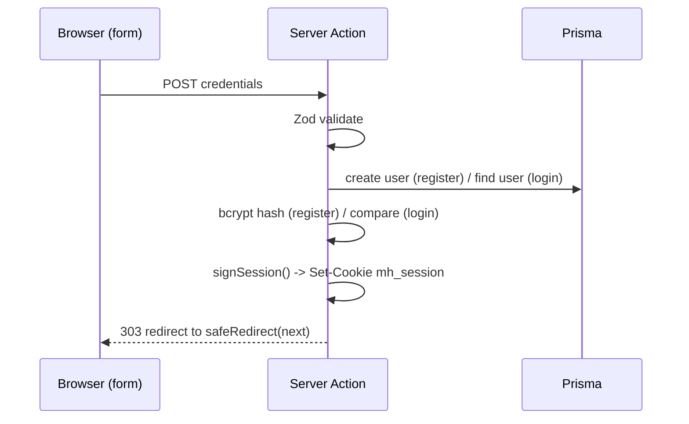
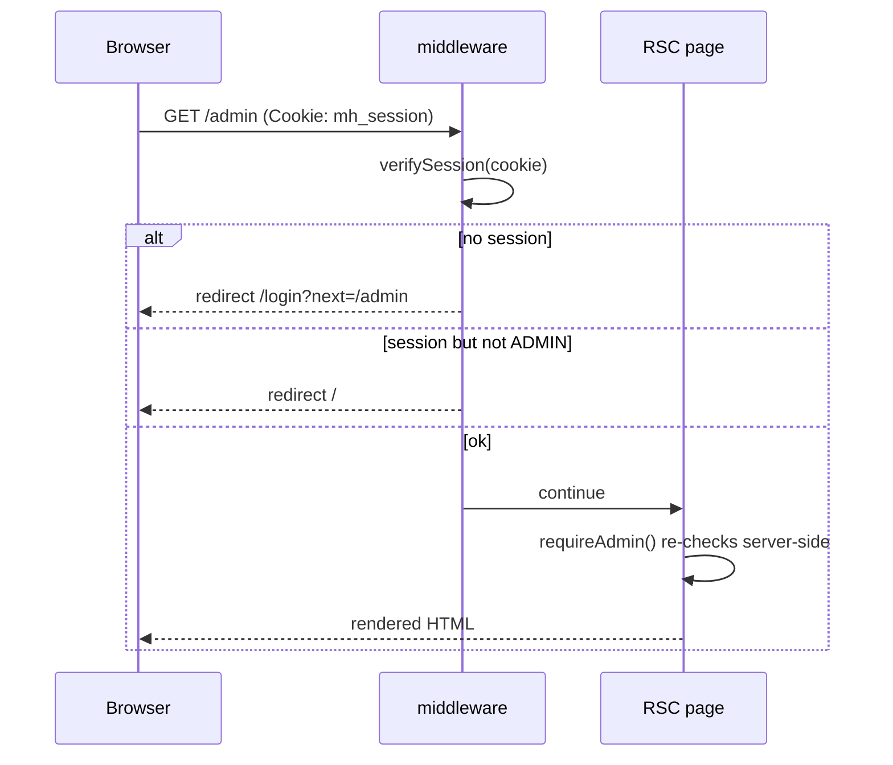

# Authentication & authorization

Muse uses a self-contained, framework-native auth layer: **email + password**
credentials, hashed with **bcrypt**, and a **signed JWT stored in an httpOnly
cookie**. There is no third-party auth provider.

## Modules

| File | Responsibility | Runtime |
| --- | --- | --- |
| [`lib/session.ts`](../src/lib/session.ts) | Sign/verify the JWT; cookie name & max-age. Uses `jose` (no DB, no `next/headers`). | Edge + Node |
| [`lib/auth.ts`](../src/lib/auth.ts) | Read/set/clear the cookie; `getCurrentUser`, `requireUser`, `requireAdmin`. Marked `server-only`. | Node (RSC) |
| [`actions/auth.ts`](../src/actions/auth.ts) | `registerAction`, `loginAction`, `logoutAction`. | Node (server action) |
| [`middleware.ts`](../src/middleware.ts) | Guards protected route prefixes at the edge. | Edge |

Splitting *session crypto* (`session.ts`) from *cookie/DB access* (`auth.ts`) is
deliberate: middleware runs on the edge runtime where `jose` works but Prisma and
`next/headers` do not, so it imports only `session.ts`.

## The session token

`signSession(user)` produces an HS256 JWT whose payload is the minimal
`SessionUser`:

```ts
type SessionUser = { id: string; name: string; email: string; role: "USER" | "ADMIN" };
```

`verifySession(token)` verifies the signature **and** validates the claim shape,
returning `null` for anything missing, malformed, expired, or signed with the
wrong secret. The token is signed with `AUTH_SECRET` and expires after 7 days.

## The cookie

Set in `createSession()` ([`lib/auth.ts`](../src/lib/auth.ts)):

| Attribute | Value | Why |
| --- | --- | --- |
| name | `mh_session` | |
| `httpOnly` | `true` | JS can't read it (XSS-resistant) |
| `secure` | `true` in production | HTTPS-only in prod |
| `sameSite` | `lax` | CSRF mitigation while allowing top-level navigation |
| `path` | `/` | sent to the whole app |
| `maxAge` | 7 days | matches token expiry |

## Flows

### Register / login



On validation or credential failure the action returns an `AuthState`
`{ error?, fieldErrors?, values? }` that the form renders inline (no redirect).

### Authenticated request



### Logout

`logoutAction` clears the cookie (`destroySession`) and redirects to `/`.

## Roles & guards

Protection is applied in **two layers** (defense in depth):

1. **Edge middleware** ([`middleware.ts`](../src/middleware.ts)) matches
   `/admin/:path*`, `/submit/:path*`, `/dashboard/:path*`. It redirects
   unauthenticated users to `/login?next=…` and non-admins away from `/admin`.
2. **Server-side guards** inside pages/actions:
   - `getCurrentUser()` → `SessionUser | null`
   - `requireUser(redirectTo?)` → redirects to login if not signed in
   - `requireAdmin()` → redirects non-admins; used by the admin layout and every
     admin mutation.

Guarding again at the action/page level means a route is safe even if the
middleware matcher is ever changed.

## Open-redirect protection

The `next` query param (where to send the user after auth) is always passed
through `safeRedirect()` ([`lib/utils.ts`](../src/lib/utils.ts)) before use. It
accepts only same-origin absolute paths and rejects `//host`, `/\host`, absolute
URLs, and non-string values — falling back to `/`. This is covered by unit tests
in `test/utils.test.ts`.

## Production checklist

- [ ] Set a strong `AUTH_SECRET` (`openssl rand -base64 32`). The committed value
      in `.env` is for local development only.
- [ ] Serve over HTTPS so the `secure` cookie flag takes effect.
- [ ] Consider shortening the token lifetime and/or adding refresh if you need
      server-side revocation (JWTs are stateless and valid until they expire).
- [ ] Switch to Postgres + Prisma migrations (see [data model](./data-model.md)).
