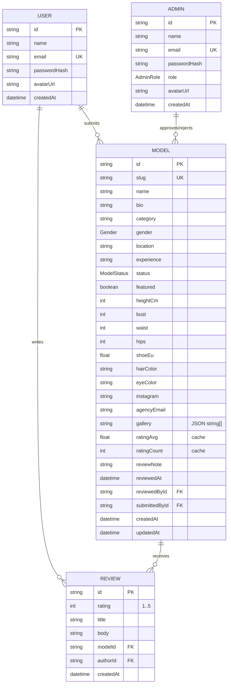

# Data model

The schema lives in [`prisma/schema.prisma`](../prisma/schema.prisma) and targets
SQLite. Four entities — **User** (public member), **Admin** (agency staff),
**Model** (a talent profile) and **Review** — plus three enums.

**User and Admin are deliberately separate tables.** A public member can submit
talent and write reviews but has no role and no path to admin access; admin
identity, credentials and roles live entirely in `Admin`. See
[authentication](./authentication.md) for the two-session design.



## Enums

| Enum | Values |
| --- | --- |
| `AdminRole` | `SUPER_ADMIN`, `MODERATOR` |
| `ModelStatus` | `PENDING`, `APPROVED`, `REJECTED` |
| `Gender` | `FEMALE`, `MALE`, `NONBINARY` |

## User (public member)

| Field | Type | Notes |
| --- | --- | --- |
| `id` | `String` | cuid primary key |
| `name` | `String` | display name |
| `email` | `String` | unique; stored lowercased |
| `passwordHash` | `String` | bcrypt hash (never a plaintext password) |
| `avatarUrl` | `String?` | optional |
| `createdAt` | `DateTime` | |

Members have **no role** — the app has no notion of an "admin user". Admin
access is a separate identity in the `Admin` table.

**Relations**

- `models` — profiles this user submitted (`Model.submittedBy`).
- `reviews` — reviews this user wrote.

## Admin (agency staff)

A distinct table with its own credentials and login. Nothing links an `Admin`
back to a `User`; they are independent identities.

| Field | Type | Notes |
| --- | --- | --- |
| `id` | `String` | cuid primary key |
| `name` | `String` | display name |
| `email` | `String` | unique; stored lowercased |
| `passwordHash` | `String` | bcrypt hash |
| `role` | `AdminRole` | defaults to `MODERATOR` |
| `avatarUrl` | `String?` | optional |
| `createdAt` | `DateTime` | |

**Roles**

- `MODERATOR` — approve/reject submissions, feature and remove profiles.
- `SUPER_ADMIN` — everything a moderator can do, **plus** manage the admin list
  (create/remove admins) at `/admin/admins`.

**Relations**

- `reviewedModels` — profiles this admin approved/rejected (`Model.reviewedBy`).

## Model (talent profile)

The central entity. Fields fall into five groups:

- **Identity:** `slug` (unique, used in the URL), `name`, `headshotUrl`, `bio`,
  `category`, `gender`, `location`, `experience`.
- **Physical stats:** `heightCm` (required), plus optional `bust`, `waist`,
  `hips`, `shoeEu`, `hairColor`, `eyeColor`.
- **Contact / media:** `instagram`, `agencyEmail`, and `gallery` — a
  **JSON-encoded `string[]`** of portfolio image URLs (SQLite has no array type).
- **Ratings cache:** `ratingAvg` and `ratingCount`, kept in sync on every review
  write (see below).
- **Workflow metadata:** `status`, `featured`, `reviewNote`, `reviewedAt`,
  `reviewedById` (→ `Admin`), `submittedById` (→ `User`).

**Indexes:** `@@index([status])` and `@@index([category])` — the two columns the
gallery and admin queries filter on most.

## Review

| Field | Type | Notes |
| --- | --- | --- |
| `rating` | `Int` | 1–5, enforced by Zod on the way in |
| `title` | `String?` | optional headline |
| `body` | `String` | the review text |
| `modelId` + `authorId` | FKs | `onDelete: Cascade` from both sides |

**`@@unique([modelId, authorId])`** enforces **one review per user per model**.
Re-submitting updates the existing review (the action uses `upsert`).

## The rating cache

`Model.ratingAvg` / `ratingCount` are denormalised so the gallery can sort and
display ratings without aggregating on every read. They are recomputed whenever a
review is created or updated, in
[`src/actions/reviews.ts`](../src/actions/reviews.ts):

```ts
const agg = await prisma.review.aggregate({
  where: { modelId },
  _avg: { rating: true },
  _count: { _all: true },
});
await prisma.model.update({
  where: { id: modelId },
  data: {
    ratingAvg: Math.round((agg._avg.rating ?? 0) * 10) / 10, // one decimal
    ratingCount: agg._count._all,
  },
});
```

The seed script performs the same computation so seeded data starts consistent.

## Seed data

[`prisma/seed.ts`](../prisma/seed.ts) is idempotent (it clears all four tables
first) and creates:

- 2 admins — 1 `SUPER_ADMIN` and 1 `MODERATOR` (the moderator is recorded as the
  reviewer on approved/rejected profiles).
- 3 users — a casting director, a photographer and a general user, used as
  review authors.
- 13 talent profiles — 9 approved (several featured), 3 pending, 1 rejected
  (with an admin note), across all categories/genders.
- 16 reviews, with the rating cache filled in.

Demo credentials are printed at the end of the seed and listed in the root
README.

## Working with the schema

```bash
npm run db:push     # apply schema changes to the SQLite file
npm run db:seed     # (re)seed demo data
npm run db:reset    # force-reset + reseed
npm run db:studio   # browse data in Prisma Studio
```

### Moving to Postgres

1. Change the datasource in `schema.prisma`:
   ```prisma
   datasource db {
     provider = "postgresql"
     url      = env("DATABASE_URL")
   }
   ```
2. Point `DATABASE_URL` at your Postgres instance.
3. Run `npx prisma migrate dev` (switch from `db push` to migrations for a real
   deployment).

The `gallery` JSON-string column works on both engines; on Postgres you could
alternatively switch it to a native `String[]`.
